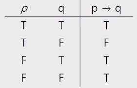
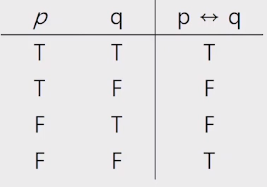
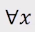
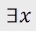
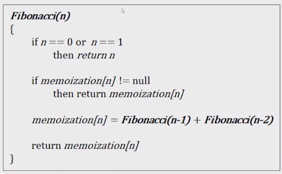
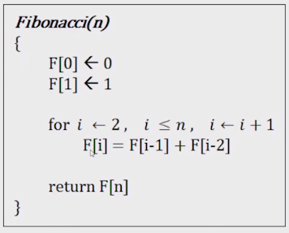

- [

- https://mungto.tistory.com/category/%EC%9D%B4%EB%A1%A0%EA%B3%B5%EB%B6%80/%EA%B8%B0%ED%83%80](https://mungto.tistory.com/category/이론공부/기타)

- https://sangwoo0727.github.io/categories/

- 명제 : 참이나 거짓을 알 수 있는 식이나 문장

  - 항진명제 : 진릿값이 항상 참

  - 모순명제 : 진릿값이 항상 거짓

  - 사건명제 : 항진명제도 모순명제도 아닌 명제

  - 조건명제 : p, q가 명제일 때, 명제 p가 조건, q가 결론으로 제시되는 명제, `p → q`

    

  - 쌍방조건명제 : p, q가 명제일 때, 명제 p와 q가 모두 조건이면서 결론인 명제, `p ↔ q`

    

- 진릿값 : 참이나 거짓을 표현

- 연산

  - 부정(NOT) : ~/￢
  - 논리곱(AND) : ^, 둘 다 T일 때만 T
  - 논리합(OR): ˇ, 둘 다 F일 때만 F
  - 배타적 논리합 (XOR): 하나만 T이여만 T, 둘 다 T면 F
  - 우선순위 `~/￢(NOT)` > `^(AND)`, `ˇ(OR)` > `→, ↔`

- 수학적 귀납법 : P(1)이 참이고 P(n) → P(n+1)이 참이면 P(n)은 모든 자윤서 n에 대해서 참이다.

  - 강한형태 : P(1)이 참이고, P(1)^P(2)^...^P(n) → P(n+1)이 참이면 P(n)은 모든 자윤서 n에 대해서 참이다.
  - 버블소트 증명
    - 임의의 i번째 수는 i+n번째 수보다 작거나 같다.
    - 임의의 i번째 수는 i+1번째 수보다 작거나 같다.
    - i번째 수를 반환하는 함수를 f라 한다면 위의 조건에 따라
    - f(i) <= f(i+1), f(i+1) <= f(i+2)이므로 f(i) <= f(i+2)이다.
    - f(i) <= f(i+n)이 성립한다고 가정하자. f(i+n) <= f(i+n+1)이므로 f(i) <= f(i+n+i)이다.
    - f(i) <= f(i+n)이면 f(i) <= f(i+(n+1))이 성립한다.
    - 수학적 귀납법에 따라 f(i) <= f(i+n)이 성립함을 알 수 있다.

- 간소화
  - `(p^~q) or (p^q)` = `p^(~q or q)` = `p^항진명제` = `p`
  - `(p or ~q) ^ (~p or ~q)` = `(p ^ ~p) or ~q` = `~q or (p ^ ~p)` = `~q or 모순명제` = `~q`

-  : 모든의 의미, 모든 x가 조건을 성립해야만 T //  : 어떤의 의미, 하나의 x라도 조건을 성립하면 T

- 문제

  - 2진수 표현에서 logn 비트로 표현할 수 있는 숫자 범위는?

  ```
  n 비트 -> 2^n개
  logn 비트 -> n개
  ```

  

- 귀류법 : 명제를 증명하려 할 때, 그 명제의 부정을 참이라고 가정 -> 참이 아님을 보이고 -> 원래 가정이 참임을 증명
- 피보나치 수열 (Memorization)



- 피보나치 수열 (Dynamic Programming)

  

- 재귀, memorization, dynamic programming 중 동적계획법이 가장 빠르다.