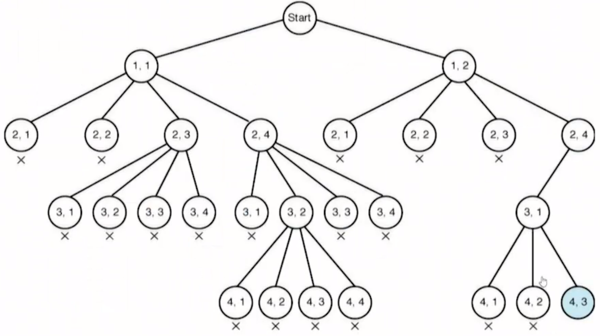

## Stack

- 물건을 쌓아 올리듯 자료를 쌓아 올린 형태의 자료구조
- 스택에 저장된 자료는 선형 구조를 갖는다.
  - 선형구조 : 자료 간의 관계가 1:1의 관계
  - 비선형구조 : 자료 간의 관계가 1:N의 관계 (ex> Tree)
- 마지막에 삽입한 자료를 가장 먼저 꺼낸다. 후입선출이라 부름
- 스택의 최상위 요소 즉, 마지막 삽입된 원소의 위치를 `top`이라고 부름
- 연산
  - 삽입 : `push`, 저장소에 자료를 저장
  - 삭제 : `pop`, 저장소에 자료를 꺼냄, 삽입한 자료의 역순으로 꺼냄


### Memorization

- 재귀함수에서 중복 호출을 막기위한 방법으로 이전에 계산했던 값은 메모리에 저장하여 다시 계산하지 않도록 함
- 실제로 피보나치의 재귀는 O(2^n)이지만 Memorization을 사용하면 O(n)으로 줄일 수 있다.

```python
def fibo(n):
    if n <= 2:
        return 1
    if memo[n]:
        return memo[n]
    
    memo[n] = fibo(n-1) + fibo(n-2)
    return memo[n]

memo = [0, 1, 1] + [0] * 100
```


### DP (Dynamic Programming)

- 동적계획(DP) 알고리즘은 Greedy와 같이 최적화 문제를 해결하는 알고리즘
- 입력 크기가 작은 부분 문제들을 해결한 후에 그 해를 이용하여 큰 크기의 부분 문제들을 해결, 최종적으로 원래 주어진 입력의 문제를 해결하는 알고리즘
- 재귀를 사용하지 않기 때문에 효율적일 수 있다. (재귀는 호출에서 오버헤드가 발생하기 때문)

```python
def fibo(n):
    f = [0, 1]
    for i in range(2, n+1):
        f.append(f[i-1] + f[i-2])
    return f[n]
```


### DFS (Depth First Search, 깊이우선탐색)

- 비선형구조(ex> 그래프)에서 표현된 모든 자료를 빠짐없이 검색하는데 유용함
- 길을 이어가다가 막히게 되면 이전의 갈림길로 돌아가서 다른 방향으로 다시 진행함
- 가장 마지막 갈림길의 경로까지 완료하면 끝이 난다.

```python
## V: 정점수 E: 간선수, G: 그래프
# 스택이용
visit = [0] * (V+1)
S = []
v = 1	# v : 방문한 정점
visit[v] = 1

while S:	# 빈 스택이 아닐 동안
    # v가 방문하지 않은 인접 정점을 찾자
    for w in G[v]:
        if visit[w]: continue	# 이미 방문했으면 continue
        # v ----> w v에서 w로 갈려고 함
        S.append(v)
        visit[w] = 1
        v = w
        break
    else:
        # 그 이전에 방문한 정점으로
        v = S.pop()
            
# 재귀함수
visit = [0] * (V+1)
def DFS(v):
    visit[v] = 1
    for w in G[v]:
        if visit[w]: continue
        DFS(w)
```


### Backtracking

- 해를 찾는 도중에 막히면 이전 경로로 되돌아가서 다시 해를 찾아가는 기법
- DFS는 모든 경로를 찾는다면 백트래킹은 가능성이 있는 부분만 찾는다 즉, 불필요한 경로는 사전에 차단하여 찾는 횟수를 최소화한다.
- 절차
  1. 상태 공간 트리의 깊이 우선 검색 실시
  2. 각 노드가 유망한지 점검
  3. 만일 그 노드가 유망하지 않으면, 그 노드의 부모 노드로 돌아가서 검색을 계속



- 위 상태 공간 트리를 통해 27회만에 해답을 찾을 수 있다. 이 때, DFS의 경우 155회 모두 검사를 실시한다.
- 백트래킹의 대표적 예제, N-queen

```python
# idea :: 행은 N = 4일때 0,1,2,3 순서대로 고정됨 반대로 열은 0,1,2,3 중 겹치지 않도록 놓아야 함. 즉, 열의 값을 순열로 찾으면 됨. 이제 대각의 위치만 고려하면 되는데 같은 대각에 위치한다는 것은 뒤개의 점에서 행값의 차이와 열값의 차이가 같은 경우이다.

def possible(k, c):	# k번 퀸의 위치는 (k, c)
    for i in range(k):
        if k - i == abs(c - col[i]): return False
    return True

def nQueen(k):
    if k == N:
        pass
    else:
        for i in range(N):
            if visit[i]: continue
            # 퀸들이 서로 대각에 위치하는지 판단
            # k번째 퀸의 열값을 i로 결정
            # 그 이전에 결정한 상태는 0 ~ k-1 번까지
            if not possible(k, i): continue
            visit[i] = 1
            col[k] = i
            nQueen(k+1)
            visit[i] = 0
            
N = int(input())
col = [0] * N
visit = [0] * N
nQueen(N)
```


```python
## idea :: 2중 for문을 이용하여 퀸을 놓았을 때, 가로-세로-대각에 위치할 수 없는 부분을 미리 마킹함

def n_queen(r): # r: 행의 번호 0~N-1까지 증가하면서 확인
    global count
    if r == N:
        # N개의 퀸을 모두 놓았음
        count += 1
        return
    for i in range(N):  # 열을 1씩 이동하면서 퀸을 놓음
        # 놓으려고 하는 노드가 유망한 노드면 퀸을 놓음
        if check[r][i] > 0: # 다른 퀸의 영향을 받고 있음
            continue
        # 현재 r행 i열에 퀸을 놓음 : 영향을 받는 모든 노드 마킹
        marking(r, i)
        n_queen(r+1)
        # 다음노드 검사를 위해서 마킹을 지워준다.
        un_marking(r, i)

def marking(r,c): # 현재 노드에 놓인 퀸에 의해서 영향을 받는 노드들에 표시
    # 가로줄 전부 마킹
    for i in range(N):
        check[r][i] += 1
    # 세로줄 전부 마킹
    for i in range(N):
        check[i][c] += 1
    # 대각선 아래로 모두 마킹
    left = c - 1
    right = c + 1
    for i in range(r+1,N):
        if left >= 0:
            check[i][left] += 1
        if right < N:
            check[i][right] += 1
        left -= 1
        right += 1


def un_marking(r,c):
    # 가로줄 전부 언마킹
    for i in range(N):
        check[r][i] -= 1
    # 세로줄 전부 언마킹
    for i in range(N):
        check[i][c] -= 1
    # 대각선 아래로 모두 언마킹
    left = c - 1
    right = c + 1
    for i in range(r + 1, N):
        if left >= 0:
            check[i][left] -= 1
        if right < N:
            check[i][right] -= 1
        left -= 1
        right += 1
        
N = int(input()) # 숫자 하나 입력받음 N
check = [[0] * N for _ in range(N)] # 해당 노드가 유망한지 아닌지 판단하는 배열
count = 0
n_queen(0)
print(count)
```


- 백트래킹을 이용한 부분집합

```python
arr = 'ABC'
N = len(arr)
bit = [0]*N

# 일반적
for i in range(2):
    bit[0] = i
    for i in range(2):
        bit[1] = i
        for i in range(2):
            bit[2] = i
            for j in range(N):
                if bit[j]:
                    print(arr[j], end=' ')
            print()

# 재귀함수 이용
def subset(k, n):	# k: 함수호출의 깊이, n: 호출 트리의 높이, 단말노드
    if k == n:
        print(bit)
    else:
        bit[k] = 0
        subset(k+1, n)
        bit[k] = 1
        subset(k+1, n)
subset(0,N)

# 백트래킹 이용
order = []
def perm(k, n):
    if k == n:
        print(order)
    else:
        for i in range(N):
            if visit[i]: continue
            visit[i] = 1
            order.append(arr[i])
            perm(k+1,n)          
            visit[i] = 0
            order.pop()
perm(0,N)
```

