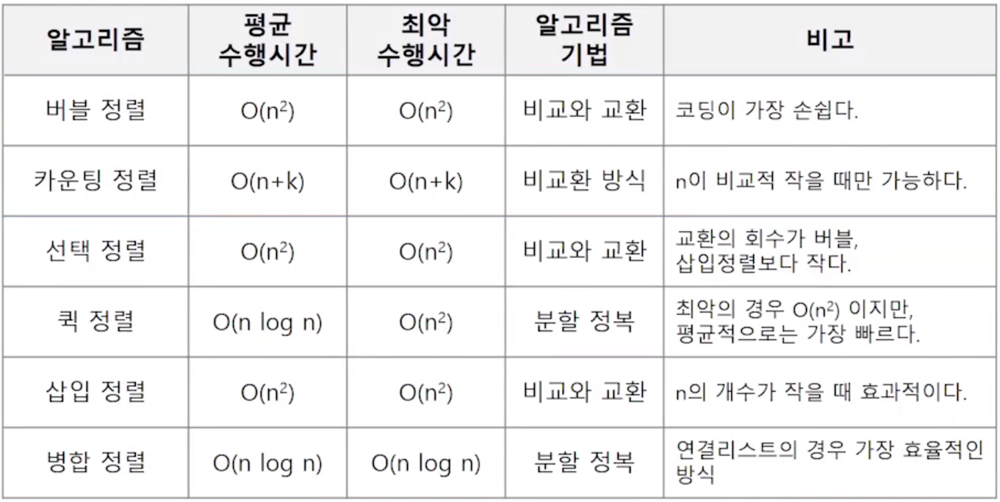
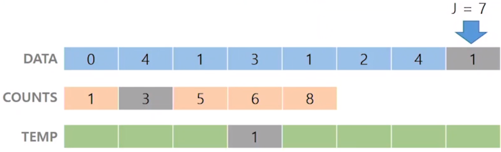

## 정렬



### 버블 정렬 (Bubble Sort)

- 인접한 두 개의 인덱스를 비교하며 자리를 계속 교환하는 방식

- 시간복잡도 O(n^2)

- 과정

  1. 첫 번째 인덱스부터 인접한 인덱스끼리 비교하여 교환하면서 맨 마지막 자리(n-1)까지 이동

  2. 가장 큰 값이 n-1에 위치했으므로 위의 과정을 n-2까지 진행
  3. 계속 반복하여 마지막인 1번 원소까지 진행되면 완료

```python
def BubbleSort(arr): # arr = 정렬할 List
	for i in range(len(arr)-1, 0, -1):
    	for j in range(0, i):
        	if arr[j] > arr[j+1]:
            	arr[j], arr[j+1] = arr[j+1], arr[j]
```


  ### 카운팅 정렬 (Counting Sort)

- 항목들의 순서를 결정하기 위해 직합에 각 항목이 몇 개씩 있는지 세고, 좀 더 빠른 시간에 정렬하는 알고리즘
- 시간복잡도 O(n+k) (n : 리스트길이, k : 정수의 최대값)
- 제한사항
  - 정수로 표현할 수 있는 자료에 대해서만 적용 됨 (정수 항목으로 인덱스 되는 카운트들의 배열을 사용해서)
  - 집합 내의 가장 큰 정수를 알아야 사용할 수 있다. (카운트를 위한 새로운 배열의 공간을 미리 할당해서)

- 과정

  1. 정렬하려는 배열 중 가장 큰 수만큼의 idx를 가지는 counts 배열을 만든다.

  2. 배열에서 각 항목값들의 횟수를 세고 배열의 값 = counts의 idx에 횟수를 저장한다.

     예를들어 배열이 [2,2,2,2]라면 counts = [0,0,4]가 된다. (counts[2]에 횟수 4를 저장)

  3. counts를 누적합으로 바꾼다.

     예를들어 counts = [1,6,4]이었다면 counts = [1,6+1, 4+6+1] = [1,7,11]

     이는 원하는 숫자 앞에 몇개가 있는지 누적합을 통해 알 수 있기 때문

     [1,7,11]의 경우 배열 중 3은 2까지의 합인 7다음인 8부터 올 수 있다는 정보를 획득할 수 있다.

     또는 배열 중 3은 11부터 8까지에 위치할 수 있다.

  4. 정렬하려는 배열과 같은 크기의 새 배열을 만들어주고

     기존 배열 끝부터 정렬을 시작한다. 

     

     DATA의 끝 idx의 값 = 1 -> counts는 배열값들의 횟수를 나타내어 준다. 즉, 1은 counts idx 1에 위치해 있고 누적합을 통해 정렬된 배열에서 1이 위치할 수 있는 idx의 최대값 정보를 준다.

     이를 통해 새배열에 idx의 최대값 위치에 1을 넣어주고 count에서는 1회 사용했기 때문에 값을 1줄여준다

     이를 반복하면 TEMP에 정렬된 배열이 완성된다.

  ```python
  def Counting_Sort(A, B, k):
  # A = 입력 배열 (data)
  # B = 정렬 배열 (temp)
  # C = 카운트 배열 (counts)
  	C = [0] * (k+1)
      for i in range(0, len(B)):
          C[A[i]] += 1
          
      for i in range(1, len(C)):
          C[i] += C[i-1]
      
      for i in range(len(B)-1,-1,-1):
          B[C[A[i]]-1] = A[i]
          C[A[i]] -= -1
  ```


### 선택 정렬 (Selection Sort)

- 주어진 자료 중 가장 작은 값의 값부터 차례대로 선택하여 위치를 교환
- 시간 복잡도 O(n^2)
- k번째로 크거나 작은 값을 찾는 방법 (굳이 다 정렬하지 않아도 됨)
  - k가 비교적 작을 때 유용하며 O(kn)의 수행시간을 필요로 한다.
- 과정

  1. 주어진 자료 중에서 최소값을 찾는다.
  2. 그 값을 맨 앞에 위치한 값과 교환한다.
  3. 맨 처음 위치를 제외한 나머지 인덱스를 대상으로 위의 과정 반복

```python
def SelectionSort(a):
    for i in range(0, len(a)-1):
        min = i
        for j in range(i+1, len(a)):
            if a[min] > a[j]:
                min = j
        a[i], a[min] = a[min], a[i]
        
#x번째로 작은 원소를 찾는 알고리즘
def SelectionSort(a, k):
    for i in range(0, k):	# x번만 반복해도 됨
        min = i
        for j in range(i+1, len(a)):
            if a[min] > a[j]:
                min = j
        a[i], a[min] = a[min], a[i]
    return a[k-1]
```

  