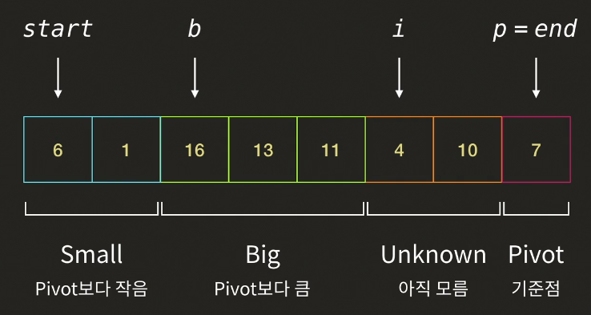

# 탐색

- 선형 탐색

앞인덱스부터 차례대로 탐색

정렬되어있지않아도 사용가능

비효율적

- 이진 탐색

중간값과의 대소를 구분한 뒤 해당 안되는 범위인 절반을 날림

정렬되어있어야만 사용가능

효율적

# 정렬

- 선택정렬 : 각 위치에 어떤 값이 들어갈지 찾는다.

0번인덱스부터 탐색

가장작은값 -> 0번 인덱스와 교체

1번인덱스부터 탐색

두번째작은값 -> 1번 인덱스와 교체

...

가장 큰 값 -> 마지막 인덱스

- 삽입정렬 : 각 값이 어떤 위치에 들어갈지 찾는다.

값이 주어지면 그 값보다 앞에 있는 인덱스와 비교해서 정렬함

1번인덱스부터 시작

예)

1번인덱스 -> 0번과 비교 0번보다 작다면 0번위치와 바꿈

2번인덱스 -> 1번과 비교 1번보다 작다면 1번위치와 바꿈 0번보다 크다면 1번 위치에 머뭄

3번인덱스 -> 2번과 비교 2번보다 크다면 3번 위치에 머뭄

...

# 시간 복잡도

- 점근표기법(Big-O)

n(input)의 영향력이 가장 큰 곳만 표기

n이 엄청크다고 가정한 것 (n이 작으면 시간 복잡도를 계산할 필요가 없기 때문)

예)

20**n** + 40 -> O(n)

2**n^2** + 7n + 1000000 -> O(n^2)

0.001**n^3** + 10000000000n -> O(n^3)

앞서 배운 선형 탐색알고리즘은 O(n), 이진탐색알고리즘은 O(logn)의 시간복잡도를 가진다.

# Bruth force

- 가능한 모든 경우의 수를 사용하는 가장 기본적인 알고리즘
- 굉장히 비효율적인 알고리즘
- 직관적이고 명확하다, 답을 확실하게 찾을 수 있다는 장점
- 인풋이 작으면 사용가능하지만 크다면 다른 알고리즘을 택할 것 but 다른 알고리즘을 찾는 출발점은 Bruth force이다.

# 분할정복(Divide and Conquer)

- 문제가 너무 큰 경우 부분문제로 나눠서 푸는 것
- Divide + Conquer + Combine 세단계로 이루어짐
- Divide(분할) : 문제를 나눔
- Conquer(정복) : 나눈 문제를 푸는 함수를 만듦, Conquer를 다시 분할정복 할 수 있음
- Combine : 나눈 솔루션을 이용하여 기존 문제를 해결

# 합병 정렬 (Merge Sort)

- Divide : 리스트를 반으로 나눈다.
- Conquer : 왼쪽 리스트와 오른쪽 리스트를 각각 정렬한다.
- Combine : 정렬된 두 리스트를 하나의 정렬된 리스트로 합병한다.
  - 왼쪽, 오른쪽 리스트의 각각 첫번째 인덱스를 비교한다.
  - 더 작은값을 새로운 리스트에 차례대로 삽입해주고 기존 리스트는 인덱스를 1 추가시킨다.
  - 한쪽 리스트가 끝나면 나머지 리스트를 새로운 리스트에 마저 삽입해준다.

# 퀵 정렬 (Quick Sort)

- 리스트를 나누는 Partiton과정이 있다.
  - 나누는 기준인 Pivot을 정한다.
  - Pivot을 기준으로 작은값은 Pivot의 왼쪽으로 큰값은 오른쪽으로 배치한다.
- Divide : Partiton 과정
- Conquer : Pivot 왼쪽, 오른쪽을 정렬해 줌
- Combine : 없음

- Partition 과정

- pivot = end로 둔다고 가정, Pivot보다 큰 Big그룹의 b와 아직 탐색하지 않은 Unknown의 i 변수를 둠
- b는 Big그룹의 가장 첫번째 인덱스에 위치함 b,i의 시작점은 start로 같다.
- i가 탐색한 값이 pivot보다 크다면 b는 이동하지 않고 i만 오른쪽으로 한칸이동
- i가 탐색한 값이 pivot보다 작다면 i의 값과 b의 값을 서로 바꿔주고 i와 b 둘다 오른쪽으로 한칸이동
  - 그렇다면 자연스럽게 Small그룹이 b의 왼쪽에 형성이 된다.
- i가 end까지 완료를 했다면 p와 b의 위치를 바꾸면 Pivot을 기준으로 왼쪽엔 Small 오른쪽엔 Big그룹이 위치함

