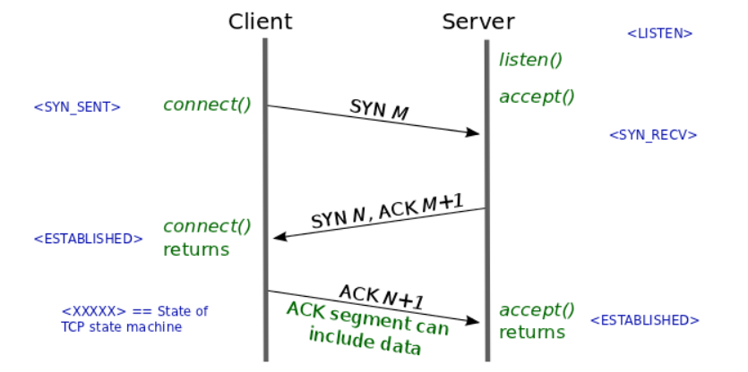

# 목차

[`완전검색`](#완전검색), [`Greedy`](#탐욕알고리즘), [`동적계획법`](#동적계획법), [`Memorization`](#Memorization), [`시간복잡도`](#시간복잡도), [`공간복잡도`](#공간복잡도), [`버블정렬`](#버블정렬), [`카운팅정렬`](#카운팅정렬), [`선택정렬`](#선택정렬), [`합병정렬`](#합병정렬), [`퀵정렬`](#퀵정렬), [`삽입정렬`](#삽입정렬)

[`순차검색`](#순차검색), [`이진검색`](#이진검색)

# 내용

## Network

### DOM

- Documents Object Model, 웹 페이지의 객체 지향 표현
- 문서의 구조화된 표현을 제공, DOM 구조에 접근할 수 있는 방법을 제공

### CORS

- Cross-Origin Resource Sharing, 타 도메인 간에 자원을 공유할 수 있게 해줌

### 크로스브라우징

- 다양한 플랫폼과 OS에 이상없이 구현되도록 하는 것
- 웹사이트를 비슷하게 만들어 어떤 환경에서도 이상없이 작동되도록 하자

### GET vs POST

- GET은 요청하는 데이터가 Header 부분의 url에 담겨서 전송 됨
  - 전송할 수 있는 데이터 크기가 제한적이고 보안에 취약하다
  - 조회에 사용
- POST는 요청하는 데이터가 Body 부분에 담겨서 전송 됨
  - 값이나 상태의 변경에 사용

### TCP 3-way Handshake

- 전송 제어 프로토콜(**TCP**)에서 통신을 하는 장치간 서로 연결이 잘 되어있는지 확인하는 과정, 방법이다. 
- Client에서 요청하는 SYN(a)를 전송 -> Server에서 응답의 ACK(a)와 함께 요청하는 SYN(b)를 전송 -> Client에서 응답의 ACK(b)를 전송

### UDP

- 비연결형 프로토콜
- 속도가 빠른 대신에 신뢰성이 떨어진다.
- 실시간 서비스에 종종 사용됨

### TCP

- 연결형 프로토콜
- 속도가 느린 대신에 신뢰성이 높다 (3-way, 4-way를 통한 응답을 받기 때문)
- 파일전송에 종종 사용됨

### HTTP

- HTTP 는 평문 통신이기 때문에 도청이 가능하다.
- 통신 상대를 확인하지 않기 때문에 위장이 가능하다.
- 완전성을 증명할 수 없기 때문에 변조가 가능하다.
- HTTP 는 원래 TCP 와 직접 통신

### HTTPS

- SSL 의 껍질을 덮어쓴 HTTP 라고 할 수 있다.
- HTTP 통신하는 소켓 부분을 `SSL(Secure Socket Layer)` or `TLS(Transport Layer Security)`라는 프로토콜로 대체
-  HTTP 는 SSL 과 통신하고 SSL 이 TCP 와 통신
- 많은 자원소모가 필요해서 민감한 정보를 다룰 때에 HTTPS를 사용한다.