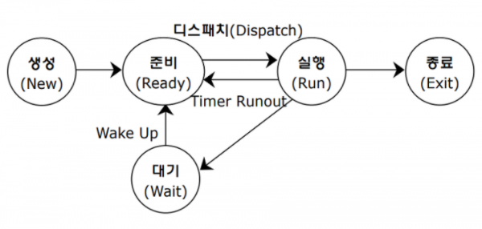
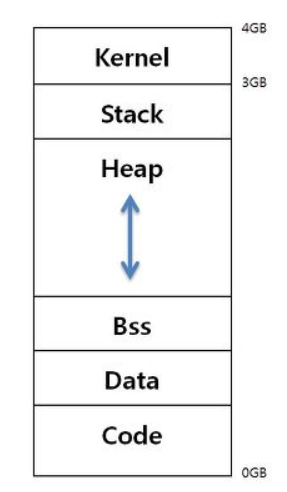

# 목차

[`운영체제 역할`](#운영체제-역할), [`운영체제의 성능`](#운영체제의-성능), [`자원관리 과정`](#자원관리-과정), [`운영체제의 역사`](#운영체제의-역사), [`Shell`](#Shell), [`CLIvsGUI`](#CLI-vs-GUI), [`사용자모드와 커널모드`](#사용자모드와-커널모드), [`시스템콜`](#시스템콜)

[`Windows특징`](#Windows-특징), [`Unix특징`](#Unix-특징), [`Linux특징`](#Linux-특징), [`프로세스`](#프로세스), [`스케쥴러`](#스케쥴러), [`FIFO 스케쥴러`](#FIFO-스케쥴러), [`SJF 스케쥴러`](#SJF-스케쥴러), [`HRRN 스케쥴러`](#HRRN-스케쥴러), [`RR 스케쥴러`](#RR-스케쥴러), [`SRT 스케쥴러`](#SRT-스케쥴러)

[`프로세스 상태`](#프로세스-상태), [`인터럽트`](#인터럽트), [`프로세스 구조`](#프로세스-구조), [`PCB`](#PCB), [`컨텍스트 스위치`](#컨텍스트-스위치), [`IPC`](#IPC), [`파이프`](#파이프), [`메시지 큐`](#메시지-큐), [`공유메모리`](#공유메모리), [`시그널`](#시그널), [`소켓`](#소켓), [`스레드`](#스레드)

[`스레드 장점`](#스레드-장점), [`스레드 단점`](#스레드-단점), [`동기화`](#동기화), [`교착상태`](#교착상태), [`가상메모리`](#가상메모리), [`내부단편화`](#내부단편화), [`외부단편화`](#외부단편화), [`페이징`](#페이징), [`요구페이징`](#요구페이징), [`페이지폴트`](#페이지폴트)

[`FIFO 교체`](#FIFO-교체), [`OPT 교체`](#OPT-교체), [`LRU 교체`](#LRU-교체), [`LFU 교체`](#LFU-교체), [`NUR 교체`](#NUR-교체), [`세그멘테이션`](#세그멘테이션), [`파일시스템`](#파일시스템)

# 내용

## 운영체제

### 운영체제 역할

- 컴퓨터는 스스로 할 수 있는 것이 없다. 따라서, 시스템 자원의 관리를 위해 운영체제가 필요하다.
- 사용자와 컴퓨터간의 인터페이스를 제공하는 소프트웨어

### 운영체제의 성능

- 처리능력 : 처리하는 일의 양
- 신뢰도 : 정확하게 해결
- 사용 가능도 : 즉시 사용 가능한 정도
- 응답시간, 반환시간 : 처리가 완료될 때까지 걸린 시간

### 자원관리 과정

- 상태 파악 -> 분배 정첵 수립 -> 자원 배당 -> 자원 회수

### 운영체제의 역사

1. 배치 처리 시스템 : 순차적으로 프로그램을 실행하는 시스템

2. 시분할 시스템 : 응용 프로그램이 CPU 시간을 분할하여 여러개의 프로그램을 실행

3. 멀티태스킹 : 여러 응용 프로그램의 병렬 실행
4. 다중 프로세싱 : CPU가 2개 이상 설치
5. 분산 처리 시스템 : 여러대의 컴퓨터들에 의해 작업을 나누어 처리

### Shell

- 사용자가 운영체제 기능과 서비스를 조작할 수 있도록 인터페이스를 제공하는 프로그램
- 사용자의 명령을 해석해서 커널에 명령을 요청해주는 역할
- 관련된 시스템콜을 사용해서 프로그래밍이 작성되어 있다.
- CLI와 GUI가 대표적

#### CLI vs GUI

- CLI (Command Line Interface) : 터미널 환경
- GUI (Graphical User Interface) : 그래픽 환경

### 사용자모드와 커널모드

- 사용자모드 : 일반적인 모드, 응용프로그램이 사용
- 커널모드 : 특권 명령어 실행과 원하는 작업 수행을 위한 자원 접근을 가능케 하는 모드

### 시스템콜

-  응용 프로그램의 요청에 따라 커널에 접근하기 위한 인터페이스 (사용자모드에서 커널 기능 사용)

### Windows 특징

- GUI
- 선점형 멀티태스킹 : 우선순위가 높은 프로세스가 할당된 CPU를 뺏을 수 있다.
- PnP(Plug and Play) : 꽂아서(Plug) 바로 사용(Play)
- OLE(Object Link Embedding) : 개체(Object)를 연결(Link)하거나 삽입(Embedding)하여 자료 공유

### Unix 특징

- 대부분 유로
- 대형 시스템 관리자가 사용
- 서버와 같은 대형 서비스에 사용

### Linux 특징

- 대부분 무료
- 개발자, 일반 사용자가 사용
- 오픈소스 개발에 사용

### 프로세스

- 실행 중인 프로그램
- 응용프로그램 = 프로세스가 아님 하나의 응용프로그램은 여러개의 프로세스로 이루어질 수 있음

### 스케쥴러

- 프로세스 실행을 관리
- 선점 스케쥴링 : 하나의 프로세스가 다른 프로세스 대신에 프로세서(CPU)를 차지할 수 있음
- 비선점 스케쥴링 : 하나의 프로세스가 끝나지 않으면 다른 프로세스는 CPU를 사용할 수 없음

#### FIFO 스케쥴러

- 비선점

- 선입선출 시스템

#### SJF 스케쥴러

- 비선점

- Shortest Job First : 가장 프로세스 실행시간이 짧은 프로세스부터 먼저 실행

#### HRRN 스케쥴러

- 비선점
- 실행시간에 얼마나 대기했는 가에 대한 점수까지 더해져서 우선순위를 매김

#### RR 스케쥴러

- 선점
- 할당된 시간만큼 시분할을 함

#### SRT 스케쥴러

- 선점
- 남은 처리시간이 가장 짧은 프로세스가 선점

### 프로세스 상태

- 준비상태 : CPU에서 실행 가능 상태
- 대기상태 : 특정 이벤트가 발생하기를 기다리는 상태 

### 인터럽트

- CPU가 프로그램을 실행하고 있을 때, 입출력 하드웨어 등의 장치나 또는 예외상황이 발생하여 처리가 필요한 경우에 CPU에 알려서 처리하는 기술
- 내부 인터럽트 : 프로그램 내부에서 발생
- 외부 인터럽트 : 주로 하드웨어에서 발생
- 시스템콜을 실행하기 위해서 인터럽트가 사용되기도 한다.

### 프로세스 구조

- Stack : 잠시 사용되었다가 사라지는 데이터를 저장하는 영역
- heap : 동적 데이터 영역
- Data : 초기화 된 전역변수
- BSS : 초기화 되지 않은 전역변수
- Code : 코드 저장

### PCB

- 실행중인 프로세스의 상태 정보 저장

### 컨텍스트 스위치

- 프로세스의 상태 정보를 PCB로부터 CPU에 로드하고 실행

### IPC

- 프로세스간 통신 방법
- 커널공간은 공유가 가능하여 커널을 통해 통신을 함

#### 파이프

- 단방향 통신, 부모 -> 자식으로 통신

#### 메시지 큐

- key 값을 여러개 만들어서 양방향 통신

#### 공유메모리

- 커널에 공유 메모리를 만들어서 공유를 통해 통신

#### 시그널

- 커널 또는 프로세스에서 다른 프로세스에 어떤 이벤트가 발생되었는지를 알려주는 기법

#### 소켓

- 소켓으로도 IPC 가능

### 스레드

- 하나의 프로세스에서 여러개의 스레드 생성 가능 : 멀티스레드
- 프로세스에서 주어진 분할된 자원을 공유해서 사용

#### 스레드 장점

- 성능 개선
- CPU 활용도 증가
- 응답성 향상

#### 스레드 단점

- 하나의 스레드에 문제가 생기면 전반에 영향을 미침
- 여러개의 스레드 생성시 성능 저하

#### 동기화

- 프로세스의 자원을 공유하므로 자원을 수정 시 각 스레드에 영향을 줌 동기화가 필요함
- 상호배제 : 한 스레드가 자원에 접근했을 때 다른 스레드는 접근을 못하도록 함
- Mutex : 임계구역에 하나의 스레드만 들어갈 수 있음
- Semaphore : 임계구역에 여러개의 스레드가 들어갈 수 있음 (허용범위 설정)

### 교착상태

- 두 개 이상의 작업이 서로 상대방의 작업이 끝나기만을 기다리고 있기 때문에 다음 단계로 진행하지 못하는 상태

- 네가지의 필요조건을 충족시켜야 함
  - 상호배제(Mutual exclusion): 프로세스들이 필요로하는 자원에 대해 배타적인 통제권을 요구한다.
  - 점유 대기(Hold and wait): 프로세스가 할당된 자원을 가진 상태에서 다른 자원을 기다린다.
  - 비선점(No preemption): 프로세스가 어떤 자원의 사용을 끝낼 때까지 그 자원을 뺏을 수 없다.
  - 순환대기(Circular wait): 각 프로세스는 순환적으로 다음 프로세스가 요구하는 자원을 가지고 있다.

### 가상메모리

- 메모리 크기의 한계를 해결하고 메모리보다 용량이 큰 프로그램을 실행하기 위해 사용됨

#### 내부단편화

- 메모리의 공간에 프로세스가 적재 될 때 잔여 공간이 있는 경우 (50MB에 30MB 프로세스 = 20MB 내부단편화)

#### 외부단편화

- 프로세스의 크기가 커서 메모리의 빈공간에 적재할 수 없는 경우 (50MB에 70MB 프로세스 = 50MB 외부단편화)

### 페이징

- 가상메모리에 보관된 프로그램과 메인메모리의 영역을 동일한 크기로 나누는 방법
- 연속적이지 않은 공간도 활용할 수 있기 때문에 외부단편화(External fragmentation)을 해결
- 매핑을 위해 페이지 매핑 테이블이 필요하다.

#### 요구페이징

- 프로세스 모든 데이터를 메모리로 적재하지 않고, 실행 중 필요한 시점에서만 메모리로 적재

#### 페이지폴트

- 어떤 메모리가 실제 물리 메모리에 없을 때 일어나는 인터럽트

#### FIFO 교체

- 선입선출
- 가장 먼저 들어온 페이지를 먼저 교체

#### OPT 교체

- 최적 페이지 교체 알고리즘 (OPTimal Replacement Algorithm)
- 오랫동안 사용하지 않을 페이지를 교체

####  LRU 교체

- 가장 많이 사용되는 페이지 교체 알고리즘 (Least Recently Used) Page Replacement Algorithm)
- 가장 오랫동안 사용하지 않은 페이지를 교체

#### LFU 교체

- 가장 적게 사용된 페이지를 교체 (Least Frequently Used)

#### NUR 교체

- 최근에 사용하지 않은 페이지부터 교체하는 기법 (Not Used Recently)

### 세그멘테이션

- 가상 메모리를 서로 크기가 다른 논리적 단위인 세그먼트(segment)로 분할
- 내부단편화는 없으나 외부단편화가 존재
- 페이징이 대체로 사용됨

### 파일시스템

- 운영체제가 저장매체에 파일을 쓰기 위한 자료구조 또는 알고리즘