# Pseudo-Class

> 출처: https://developer.mozilla.org/ko/docs/Web/CSS/Pseudo-elements

- 의사클래스(가상클래스)는 선택하고자 하는 HTML 요소의 특별한 상태를 명시할 때 사용

## 동적 의사 클래스

### `:link`

> 사용자가 아직 방문하지 않은 요소를 나타낸다.

**HTML**

```html
<a href="#ordinary-target">평범한 링크입니다.</a><br>
<a href="">이 링크는 이미 방문했습니다.</a><br>
<a>플레이스홀더 링크 (스타일 적용 안됨)</a>
```

**CSS**

```css
a:link {
  background-color: gold;
  color: green;
}
```

**Result**

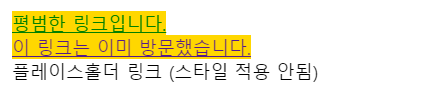


### `:visited`

> 사용자가 방문한 적이 있는 링크를 나타낸다.

**HTML**

```html
<a href="#test-visited-link">링크를 아직 방문하지 않으셨나요?</a><br>
<a href="">이미 방문했습니다.</a>
```

**CSS**

```css
a {
  /* 특정 속성에 투명하지 않은 기본값을 지정해
     :visited 상태로 바꿀 수 있도록 설정 */
  background-color: white;
  border: 1px solid white;
}

a:visited {
  background-color: yellow;
  border-color: hotpink;
  color: hotpink;
}
```

**Result**

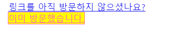


### `:hover`

> 사용자가 포인팅 장치를 사용해 상호작용 중인 요소를 선택
>
> 보통 사용자의 커서(마우스 포인터)가 요소 위에 올라가 있으면 선택된다.

**HTML**

```html
<a href="#">이 링크를 가리켜보세요.</a>
```

**CSS**

```css
a {
  background-color: powderblue;
  transition: background-color .5s;
}

a:hover {
  background-color: gold;
}
```

**Result**

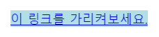

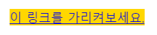


### `:active`

> 사용자가 활성화한 요소(버튼 등)를 나타낸다. 
>
> 마우스를 사용하는 경우, 마우스를 클릭하는 동안을 의미 클릭을 떼는 순간 active는 비활성화된다.
>
> 대개 `<a>`, `<button>`과 함께 사용됨

**HTML**

```html
<p>링크를 포함하는 문단입니다.
  <a href="#">이 링크는 클릭하는 동안 색이 빨갛게 됩니다.</a>
  이 문단은 클릭하는 동안 배경색이 회색이 됩니다.
</p>
```

**CSS**

```css
a:link { color: blue; }          /* 방문하지 않은 링크 */
a:visited { color: purple; }     /* 방문한 링크 */
a:hover { background: yellow; }  /* 마우스를 올린 링크 */
a:active { color: red; }         /* 활성화한 링크 */

p:active { background: #eee; }   /* 활성화한 문단 */
```

**Result**

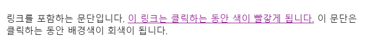

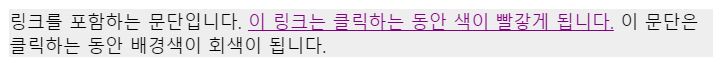

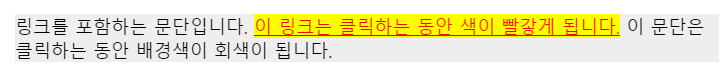


### `:focus`

> 양식의 입력 칸 등 포커스를 받은 요소를 나타낸다.
>
> 보통 사용자가 요소를 클릭 또는 탭하거나, 키보드 Tab 키로 선택했을 때 발동됨
>
> 대체로 `<input>`에서 사용됨

**HTML**

```html
<input class="red-input" value="저는 포커스를 받으면 빨갛게 됩니다."><br>
<input class="blue-input" value="저는 포커스를 받으면 파랗게 됩니다.">
```

**CSS**

```css
.red-input:focus {
  background: yellow;
  color: red;
}

.blue-input:focus {
  background: yellow;
  color: blue;
}
```

**Result**

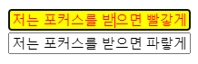

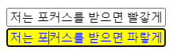

### `:target`

> 현재 활성화된 target 요소를 모두 선택함

#### 예제1

**HTML**

```html
<h3>Table of Contents</h3>
<ol>
 <li><a href="#p1">Jump to the first paragraph!</a></li>
 <li><a href="#p2">Jump to the second paragraph!</a></li>
 <li><a href="#nowhere">This link goes nowhere,
   because the target doesn't exist.</a></li>
</ol>

<h3>My Fun Article</h3>
<p id="p1">You can target <i>this paragraph</i> using a
  URL fragment. Click on the link above to try out!</p>
<p id="p2">This is <i>another paragraph</i>, also accessible
  from the links above. Isn't that delightful?</p>
```

**CSS**

```css
p:target {
  background-color: gold;
}

/* Add a pseudo-element inside the target element */
p:target::before {
  font: 70% sans-serif;
  content: "►";
  color: limegreen;
  margin-right: .25em;
}

/* Style italic elements within the target element */
p:target i {
  color: red;
}
```

**Result**

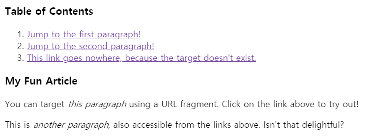

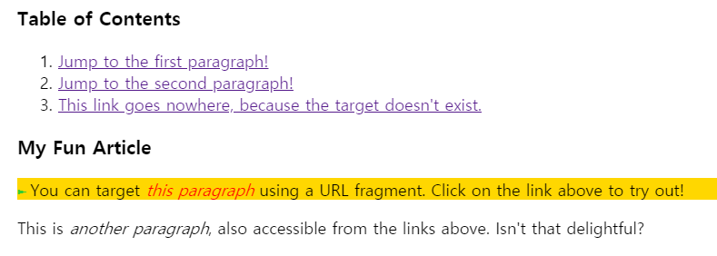

#### 예제2 (Modal만들기)

**HTML**

```html
<ul>
  <li><a href="#example1">Open example #1</a></li>
  <li><a href="#example2">Open example #2</a></li>
</ul>

<div class="lightbox" id="example1">
  <figure>
    <a href="#" class="close"></a>
    <figcaption>Lorem ipsum dolor sit amet, consectetur adipiscing elit.
      Donec felis enim, placerat id eleifend eu, semper vel sem.</figcaption>
  </figure>
</div>

<div class="lightbox" id="example2">
  <figure>
    <a href="#" class="close"></a>
    <figcaption>Cras risus odio, pharetra nec ultricies et,
      mollis ac augue. Nunc et diam quis sapien dignissim auctor.
      Quisque quis neque arcu, nec gravida magna.</figcaption>
  </figure>
</div>
```

**CSS**

```css
/* Unopened lightbox */
.lightbox {
  display: none;
}

/* Opened lightbox */
.lightbox:target {
  position: absolute;
  left: 0;
  top: 0;
  width: 100%;
  height: 100%;
  display: flex;
  align-items: center;
  justify-content: center;
}

/* Lightbox content */
.lightbox figcaption {
  width: 25rem;
  position: relative;
  padding: 1.5em;
  background-color: lightpink;
}

/* Close button */
.lightbox .close {
  position: relative;
  display: block;
}

.lightbox .close::after {
  right: -1rem;
  top: -1rem;
  width: 2rem;
  height: 2rem;
  position: absolute;
  display: flex;
  z-index: 1;
  align-items: center;
  justify-content: center;
  background-color: black;
  border-radius: 50%;
  color: white;
  content: "×";
  cursor: pointer;
}

/* Lightbox overlay */
.lightbox .close::before {
  left: 0;
  top: 0;
  width: 100%;
  height: 100%;
  position: fixed;
  background-color: rgba(0,0,0,.7);
  content: "";
  cursor: default;
}
```

**Result**

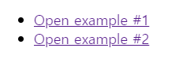

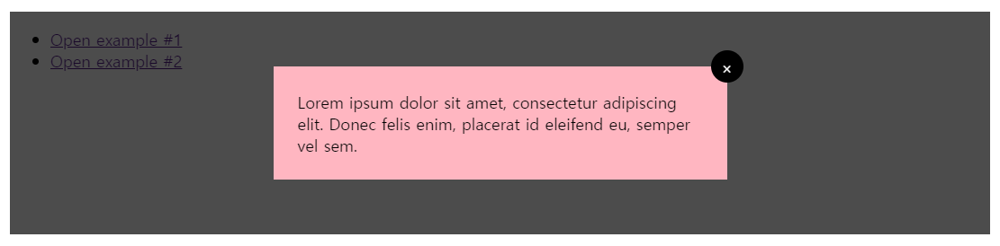


## 상태 의사 클래스

### `:checked`

> 선택했거나 `on` 상태인 **라디오**(`<input type="radio">`), **체크박스**(`<input type="checkbox">`), **옵션**(`<option>`요소를 나타냄

**HTML**

```html
<div>
  <input type="radio" name="my-input" id="yes">
  <label for="yes">Yes</label>

  <input type="radio" name="my-input" id="no">
  <label for="no">No</label>
</div>

<div>
  <input type="checkbox" name="my-checkbox" id="opt-in">
  <label for="opt-in">Check me!</label>
</div>

<select name="my-select" id="fruit">
  <option value="opt1">Apples</option>
  <option value="opt2">Grapes</option>
  <option value="opt3">Pears</option>
</select>
```

**CSS**

```css
div,
select {
  margin: 8px;
}

/* Labels for checked inputs */
input:checked + label {
  color: red;
}

/* Radio element, when checked */
input[type="radio"]:checked {
  box-shadow: 0 0 0 3px orange;
}

/* Checkbox element, when checked */
input[type="checkbox"]:checked {
  box-shadow: 0 0 0 3px hotpink;
}

/* Option elements, when selected */
option:checked {
  box-shadow: 0 0 0 3px lime; (이거 적용안되는거 같은데?)
  color: red;
}
```

**Result**

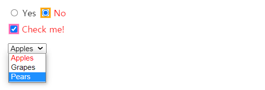


### `:enabled`, `:disabled`

> 모든 활성 요소/비활성 요소를 나타낸다. 
>
> 활성 요소란 활성(선택, 클릭, 입력 등등)하거나 포커스를 받을 수 있는 요소를 의미
>
> 비활성 요소란 활성이 불가능한 요소를 의미

**HTML**

```html
<form action="url_of_form">
  <label for="FirstField">First field (enabled):</label>
  <input type="text" id="FirstField" value="Lorem"><br>

  <label for="SecondField">Second field (disabled):</label>
  <input type="text" id="SecondField" value="Ipsum" disabled="disabled"><br>

  <input type="button" value="Submit">
</form>
```

**CSS**

```css
input:enabled {
  color: #2b2;
}

input:disabled {
  color: #aaa;
}
```

**Result**

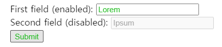


## 구조 의사 클래스

### `:first-child`, `:last-child`

> 형제 요소 중 제일 첫 요소/마지막 요소를 나타낸다

**HTML**

```html
<div>
  <p>This text is selected!</p>
  <p>This text isn't selected.</p>
</div>

<div>
  <h2>This text isn't selected: it's not a `p`.</h2>
  <p>This text isn't selected.</p>
</div>
```

**CSS**

```css
p:first-child {
  color: lime;
  background-color: black;
  padding: 5px;
}
```

**Result**

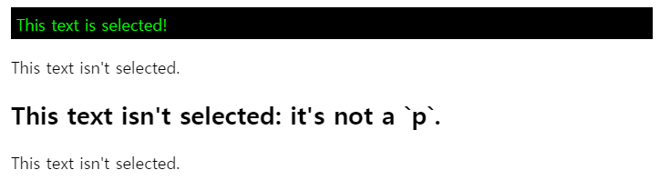


### `:nth-child`, `:nth-last-child`

> 모든 자식(child) 요소 중에서 앞에서부터/뒤에서부터 n번째에 위치하는 자식(child) 요소를 모두 선택함

- 주의할 점 : nth-child는 1부터 시작함, nth-child(0)은 아무 것도 나타내지 않는다.
- 하지만 함수형 표기법인 n은 0부터 시작한다.

#### 키워드 값

- `odd` : 홀수번째 요소를 나타냄
- `even` : 짝수번째 요소를 나타냄

#### 함수형 표기법

- `An+B` : `A`는 정수 인덱스 증감량 / `B`는 정수 오프셋 / `n`은 0부터 시작하는 모든 양의 정수

#### 표기법 예시

- **:nth-child(odd)** : 홀수번째 요소를 나타냄
- **:nth-child(even)** : 짝수번째 요소를 나타냄
- **:nth-child(3n+4)** : 4,7,10,13,... 요소를 나타냄

- **:nth-child(n+8):nth-child(-n+15)** : 형제 그룹 내에서 8번째부터 15번째 까지의 요소를 나타냄
- **:nth-child(-n+3)** : 3,2,1번째 요소를 나타냄 즉, 앞에서 세 개의 요소를 나타낸다.

**HTML**

```html
<h3><code>span:nth-child(2n+1)</code>, WITHOUT an
   <code>&lt;em&gt;</code> among the child elements.</h3>
<p>Children 1, 3, 5, and 7 are selected.</p>
<div class="first">
  <span>Span 1!</span>
  <span>Span 2</span>
  <span>Span 3!</span>
  <span>Span 4</span>
  <span>Span 5!</span>
  <span>Span 6</span>
  <span>Span 7!</span>
</div>

<br>

<h3><code>span:nth-child(2n+1)</code>, WITH an
   <code>&lt;em&gt;</code> among the child elements.</h3>
<p>Children 1, 5, and 7 are selected.<br>
   3 is used in the counting because it is a child, but it isn't
   selected because it isn't a <code>&lt;span&gt;</code>.</p>
<div class="second">
  <span>Span!</span>
  <span>Span</span>
  <em>This is an `em`.</em>
  <span>Span</span>
  <span>Span!</span>
  <span>Span</span>
  <span>Span!</span>
  <span>Span</span>
</div>

<br>

<h3><code>span:nth-of-type(2n+1)</code>, WITH an
   <code>&lt;em&gt;</code> among the child elements.</h3>
<p>Children 1, 4, 6, and 8 are selected.<br>
   3 isn't used in the counting or selected because it is an <code>&lt;em&gt;</code>, 
   not a <code>&lt;span&gt;</code>, and <code>nth-of-type</code> only selects
   children of that type. The <code>&lt;em&gt;</code> is completely skipped
   over and ignored.</p>
<div class="third">
  <span>Span!</span>
  <span>Span</span>
  <em>This is an `em`.</em>
  <span>Span!</span>
  <span>Span</span>
  <span>Span!</span>
  <span>Span</span>
  <span>Span!</span>
</div>
```

**CSS**

```css
html {
  font-family: sans-serif;
}

span,
div em {
  padding: 5px;
  border: 1px solid green;
  display: inline-block;
  margin-bottom: 3px;
}

.first span:nth-child(2n+1),
.second span:nth-child(2n+1),
.third span:nth-of-type(2n+1) {
  background-color: lime;
}
```

**Result**

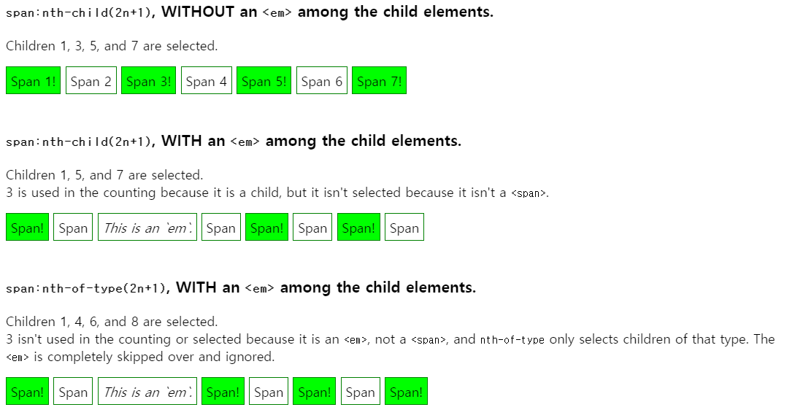

### `:fist-of-type`

> 형제 요소 중 자신의 유형과 일치하는 제일 첫 요소를 나타냄

**HTML**

```html
<article>
  <div>This `div` is first!</div>
  <div>This <span>nested `span` is first</span>!</div>
  <div>This <em>nested `em` is first</em>, but this <em>nested `em` is last</em>!</div>
  <div>This <span>nested `span` gets styled</span>!</div>
  <b>This `b` qualifies!</b>
  <div>This is the final `div`.</div>
</article>
```

**CSS**

```css
article :first-of-type {
  background-color: pink;
}
```

**Result**

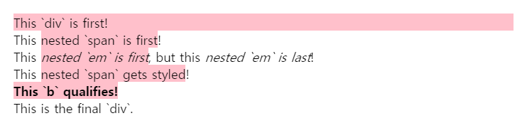

### `:nth-last-of-type`

> 모든 자식(child) 요소 중에서 뒤에서부터 n번째로 등장하는 특정 요소를 모두 선택함

**HTML**

```html
<div>
  <div>This element isn't counted.</div>
  <p>1st paragraph.</p>
  <p>2nd paragraph.</p>
  <div>This element isn't counted.</div>
  <p>3rd paragraph.</p>
  <p class="fancy">4th paragraph.</p>
</div>
```

**CSS**

```css
/* Odd paragraphs */
p:nth-of-type(2n+1) {
  color: red;
}

/* Even paragraphs */
p:nth-of-type(2n) {
  color: blue;
}

/* First paragraph */
p:nth-of-type(1) {
  font-weight: bold;
}

/* This has no effect, as the .fancy class is only on the 4th p element, not the 1st */
p.fancy:nth-of-type(1) {
  text-decoration: underline;
}
```

**Result**

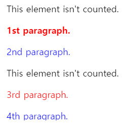


## 기타 의사 클래스

### `:not(선택자)`

> 모든 선택자와 함께 사용할 수 있으며, 해당 선택자를 반대로 적용함

**HTML**

```html
<p>Some text.</p>
<p class="classy">Some other text.</p>
<span>One more text<span>
```

**CSS**

```css
p:not(.classy) { color: red; }
body :not(p) { color: green; }
```

**Result**

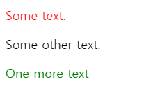

### `:lang(언어)`

> 특정 요소를 언어 설정에 따라 다르게 표현할 때에 사용함

**HTML**

```html
<div lang="en"><q>This English quote has a <q>nested</q> quote inside.</q></div>
<div lang="fr"><q>This French quote has a <q>nested</q> quote inside.</q></div>
<div lang="de"><q>This German quote has a <q>nested</q> quote inside.</q></div>
```

**CSS**

```css
:lang(en) > q { quotes: '\201C' '\201D' '\2018' '\2019'; }
:lang(fr) > q { quotes: '« ' ' »'; }
:lang(de) > q { quotes: '»' '«' '\2039' '\203A'; }
```

**Result**

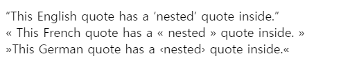