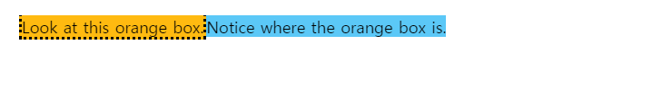
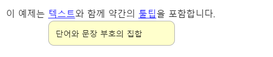
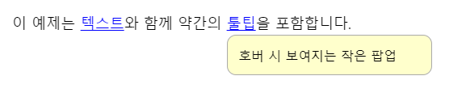
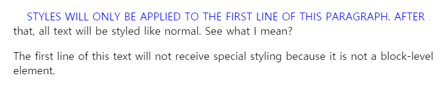
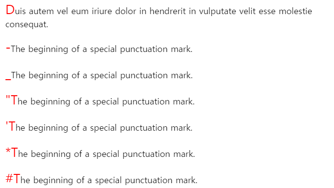
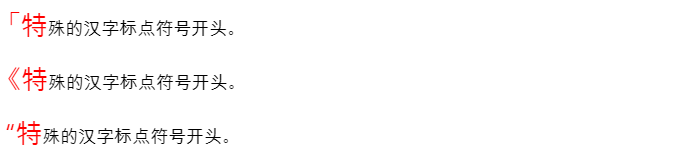
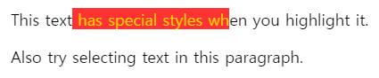
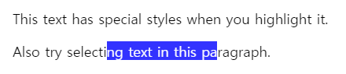
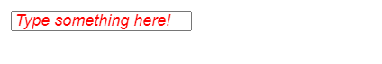

# Pseudo-Element

- 의사요소(가상요소)는 선택자에 추가하는 키워드로 선택한 요소의 일부분에만 스타일을 입힐 수 있다.

- 기본적으로 `:`는 CSS2의 문법 `::`는 CSS3의 문법이나 `:`는 CSS3에서도 사용가능하다.

- `:`는 Pseudo-Class에서 `::` Pseudo-Element에서 사용된다.

## 종류

> 대표적으로 사용하는 6가지만 알아보자
>
> 출처: https://developer.mozilla.org/ko/docs/Web/CSS/Pseudo-elements

### `::before`

> 요소츼 콘텐츠 시작부분에 생성된 콘텐츠를 추가한다.

**HTML**

```html
<span class="ribbon">Notice where the orange box is.</span>
```

**CSS**

```css
.ribbon {
  background-color: #5BC8F7;
}

.ribbon::before {
  content: "Look at this orange box.";
  background-color: #FFBA10;
  border-color: black;
  border-style: dotted;
}
```

**Result**



### `::after`

> 요소의 콘텐츠 끝부분에 생성된 콘텐츠를 추가한다.
>
> Float에서 종종 사용됨(clearfix)

**HTML**

```html
<p>이 예제는
  <span tabindex="0" data-descr="단어와 문장 부호의 집합">텍스트</span>와 함께 약간의
  <span tabindex="0" data-descr="호버 시 보여지는 작은 팝업">툴팁</span>을 포함합니다.
</p>
```

**CSS**

```css
span[data-descr] {
  position: relative;
  text-decoration: underline;
  color: #00F;
  cursor: help;
}

span[data-descr]:hover::after,
span[data-descr]:focus::after {
  content: attr(data-descr);
  position: absolute;
  left: 0;
  top: 24px;
  min-width: 200px;
  border: 1px #aaaaaa solid;
  border-radius: 10px;
  background-color: #ffffcc;
  padding: 12px;
  color: #000000;
  font-size: 14px;
  z-index: 1;
}
```

**Result**






- Float에서 사용되는 경우

```css
.clearfix::after{
	content: "";
	display: block;
	clear: both
}
// after 요소의 다음에 ""이라는 비어있는 내용으로 block을 만들고 그걸 clear 하겠다.
```


### `::first-line`

> 요소의 텍스트에서 첫 줄에 스타일을 적용한다.

**HTML**

```html
<p>Styles will only be applied to the first line of this paragraph.
After that, all text will be styled like normal. See what I mean?</p>

<span>The first line of this text will not receive special styling
because it is not a block-level element.</span>
```

**CSS**

```css
::first-line {
  color: blue;
  text-transform: uppercase;


  /* WARNING: DO NOT USE THESE */
  /* Many properties are invalid in ::first-line pseudo-elements */
  margin-left: 20px;
  text-indent: 20px;
}
```

**Result**




### `::first-letter`

> 요소의 첫 번째 글자에 스타일을 적용한다.

**HTML**

```html
<p>Duis autem vel eum iriure dolor in hendrerit in vulputate velit esse molestie consequat.</p>
<p>-The beginning of a special punctuation mark.</p>
<p>_The beginning of a special punctuation mark.</p>
<p>"The beginning of a special punctuation mark.</p>
<p>'The beginning of a special punctuation mark.</p>
<p>*The beginning of a special punctuation mark.</p>
<p>#The beginning of a special punctuation mark.</p>
<p>「特殊的汉字标点符号开头。</p>
<p>《特殊的汉字标点符号开头。</p>
<p>“特殊的汉字标点符号开头。</p>
```

**CSS**

```css
p::first-letter {
  color: red;
  font-size: 150%;
}
```

**Result**





### `::selection`

> 요소의 텍스트에서 사용자에 의하여 선택(드래그)된 영역의 속성을 변경한다.

**HTML**

```html
This text has special styles when you highlight it.
<p>Also try selecting text in this paragraph.</p>
```

**CSS**

```css
/* Make selected text gold on a red background */
::selection {
  color: gold;
  background-color: red;
} 

/* Make selected text in a paragraph white on a blue background */
p::selection {
  color: white;
  background-color: blue;
}
```

**Result**





### `::placeholder`

> Input 필드에 힌트 텍스트에 스타일을 적용한다.

**HTML**

```html
<input placeholder="Type something here!">
```

**CSS**

```css
input::placeholder {
  color: red;
  font-size: 1.2em;
  font-style: italic;
}
```

**Result**

