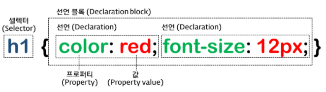
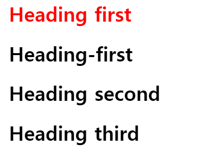
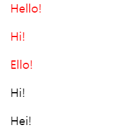
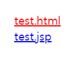
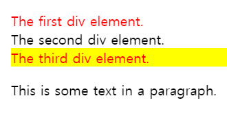
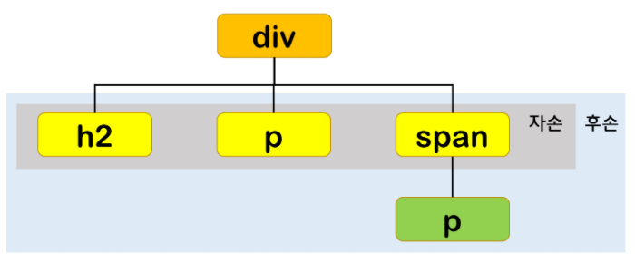
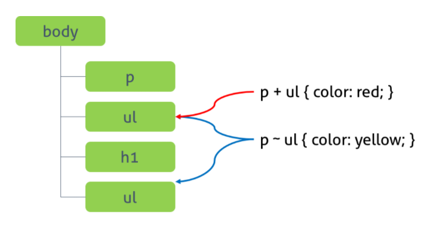
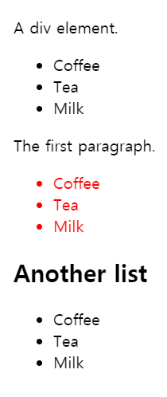
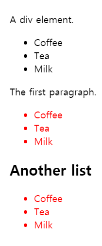

# Selector

> 출처 : https://poiemaweb.com/css3-selector



## 전체 셀렉터 (Universal Selector)

> 모든 요소 선택

| 패턴 | Description                                                  |
| :--- | :----------------------------------------------------------- |
| *    | HTML 문서 내의 모든 요소를 선택한다. html 요소를 포함한 모든 요소가 선택된다. (head 요소도 포함된다) |

**예시**

```css
* {
    margin: 0;
}
```


## 태그 셀렉터 (Type Selector)

> 지정된 태그 선택

| 패턴   | Description                             |
| :----- | :-------------------------------------- |
| 태그명 | 지정된 태그명을 가지는 요소를 선택한다. |

**예시**

```css
p {
    font-size: 10px;
}
```


## ID 셀렉터 (ID Selector)

> 지정된 ID 선택

| 패턴              | Description                                                  |
| :---------------- | :----------------------------------------------------------- |
| #id 어트리뷰트 값 | id 어트리뷰트 값을 지정하여 일치하는 요소를 선택한다. id 어트리뷰트 값은 중복될 수 없는 유일한 값이다. |

**예시**

```css
#name {
    color: #000;
}
```


## 클래스 셀렉터 (Class Selector)

> 지정된 class 선택

| 패턴                 | Description                                                  |
| :------------------- | :----------------------------------------------------------- |
| .class 어트리뷰트 값 | class 어트리뷰트 값을 지정하여 일치하는 요소를 선택한다. class 어트리뷰트 값은 중복될 수 있다. |


## 어트리뷰트 셀렉터 (Attribute Selector)

> 요소중에서 지정된 어트리뷰트를 갖는 요소 선택

### [어트리뷰트]

| 패턴               | Description                                    |
| :----------------- | :--------------------------------------------- |
| 셀렉터[어트리뷰트] | 지정된 어트리뷰트를 갖는 모든 요소를 선택한다. |

**예시**

```css
a[href] {
    color : red;
}
```


### [어트리뷰트=”값”]

| 패턴                    | Description                                                  |
| :---------------------- | :----------------------------------------------------------- |
| 셀렉터[어트리뷰트=”값”] | 지정된 어트리뷰트를 가지며 지정된 값과 어트리뷰트의 값이 일치하는 모든 요소를 선택한다. |

**예시**

```css
input[type="text"] {
    width: 10vw;
    height: 10vh;
}
```


### [어트리뷰트~=”값”]

| 패턴                     | Description                                                  |
| :----------------------- | :----------------------------------------------------------- |
| 셀렉터[어트리뷰트~=”값”] | 지정된 어트리뷰트의 값이 지정된 값을 (공백으로 분리된) 단어로 포함하는 요소를 선택한다. |

**예시**

```html
<h1 title="heading first">Heading first</h1>
<h1 title="heading-first">Heading-first</h1>
<h1 title="heading second">Heading second</h1>
<h1 title="heading third">Heading third</h1>
```

```css
h1[title~="first"] { 
    color: red; 
}
```




### [어트리뷰트|=”값”]

| 패턴                      | Description                                                  |
| :------------------------ | :----------------------------------------------------------- |
| 셀렉터[어트리뷰트\|=”값”] | 지정된 어트리뷰트의 값과 일치하거나 지정 어트리뷰트 값 뒤 연이은 하이픈(“값-“)으로 시작하는 요소를 선택한다. |

**예시**

```html
<p lang="en">Hello!</p>
<p lang="en-us">Hi!</p>
<p lang="en-gb">Ello!</p>
<p lang="us">Hi!</p>
<p lang="no">Hei!</p>
```

```css
p[lang|="en"] { 
	color: red; 
}
```




### [어트리뷰트^=”값”]

| 패턴                     | Description                                        |
| :----------------------- | :------------------------------------------------- |
| 셀렉터[어트리뷰트^=”값”] | 지정된 어트리뷰트 값으로 시작하는 요소를 선택한다. |

**예시**

```html
<a href="https://www.test.com">https://www.test.com</a><br>
<a href="http://www.test.com">http://www.test.com</a>
```

```css
a[href^="https://"] { 
	color: red; 
}
```


### [어트리뷰트$=”값”]

| 패턴                     | Description                                      |
| :----------------------- | :----------------------------------------------- |
| 셀렉터[어트리뷰트$=”값”] | 지정된 어트리뷰트 값으로 끝나는 요소를 선택한다. |

**예시**

```html
<a href="test.html">test.html</a><br>
<a href="test.jsp">test.jsp</a>
```

```css
a[href$=".html"] {
    color: red; 
}
```




### [어트리뷰트*=”값”]

| 패턴                     | Description                                      |
| :----------------------- | :----------------------------------------------- |
| 셀렉터[어트리뷰트*=”값”] | 지정된 어트리뷰트 값을 포함하는 요소를 선택한다. |

**예시**

```html
<div class="first_test">The first div element.</div>
<div class="second">The second div element.</div>
<div class="test">The third div element.</div>
<p class="test">This is some text in a paragraph.</p>
```

```css
/* div 요소 중에서 class 어트리뷰트 값에 "test"를 포함하는 요소 */
div[class*="test"] { color: red; }
/* div 요소 중에서 class 어트리뷰트 값에 "test"를 단어로 포함하는 요소 */
div[class~="test"] { background-color: yellow; }
```




## 복합 셀렉터 (Combinator)



### 후손 셀렉터 (Descendant Combinator)

- 패턴 : 셀렉터A 셀렉터B ~~~

**예시**

```css
#name .hello div {
    background-color: #ebebeb;
}
```


### 자식 셀렉터 (Child Combinator)

- 패턴 : 셀렉터A > 셀렉터B

**예시**

```css
div > a:hover {
    color: #fff;
}
```


### 형제(동위) 셀렉터 (Sibling Combinator)

> 형제(동위) 셀렉터는 형제 관계(동위 관계)에서 뒤에 위치하는 요소를 선택할 때 사용한다.



#### 인접 형제 셀렉터 (Adjacent Sibling Combinator)

> 셀렉터A의 형제 요소 중 셀렉터A 바로 뒤에 위치하는 셀렉터B 요소를 선택한다. A와 B 사이에 다른 요소가 존재하면 선택되지 않는다.

- 코드 : 셀렉터A + 셀렉터B

**예시**

```html
<div>A div element.</div>
<ul>
    <li>Coffee</li>
    <li>Tea</li>
    <li>Milk</li>
</ul>

<p>The first paragraph.</p>
<ul>
    <li>Coffee</li>
    <li>Tea</li>
    <li>Milk</li>
</ul>

<h2>Another list</h2>
<ul>
    <li>Coffee</li>
    <li>Tea</li>
    <li>Milk</li>
</ul>
```

```css
p + ul { color: red; }
```




#### 일반 형제 셀렉터 (General Sibling Combinator)

> 셀렉터A의 형제 요소 중 셀렉터A 뒤에 위치하는 셀렉터B 요소를 모두 선택한다.

- 코드 : 셀렉터A ~ 셀렉터B

**예시**

```html
<div>A div element.</div>
<ul>
    <li>Coffee</li>
    <li>Tea</li>
    <li>Milk</li>
</ul>

<p>The first paragraph.</p>
<ul>
    <li>Coffee</li>
    <li>Tea</li>
    <li>Milk</li>
</ul>

<h2>Another list</h2>
<ul>
    <li>Coffee</li>
    <li>Tea</li>
    <li>Milk</li>
</ul>
```

```css
p ~ ul { color: red; }
```




## 가상 클래스 셀렉터 (Pseudo-Class Selector)

> 따로 정리

## 가상 요소 셀렉터 (Pseuso-Element-Selector)

> 따로 정리