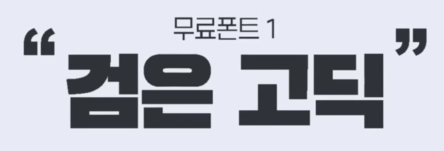
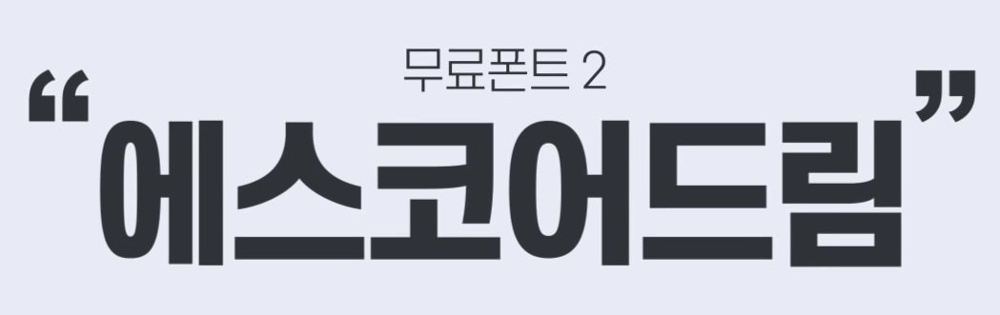
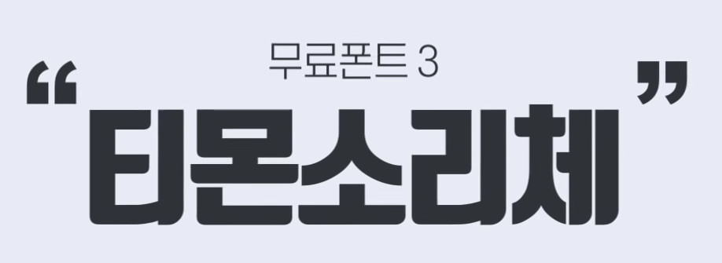
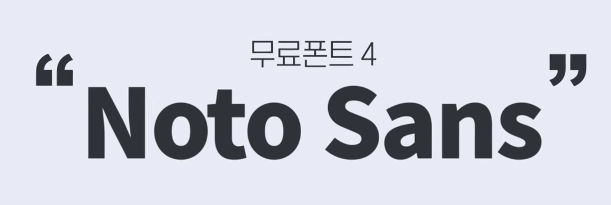
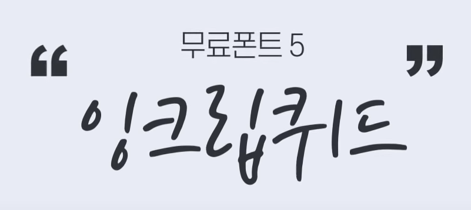
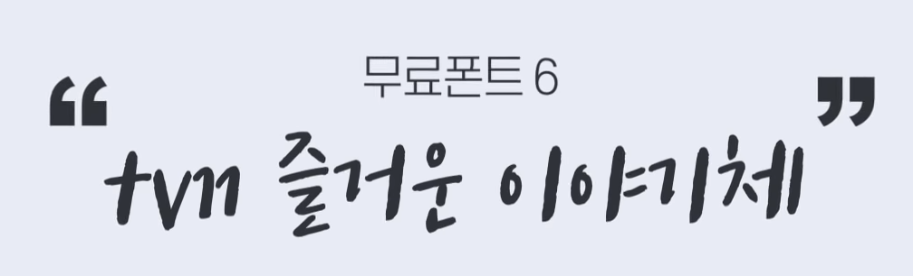
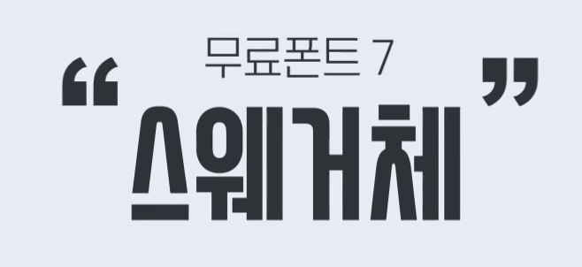
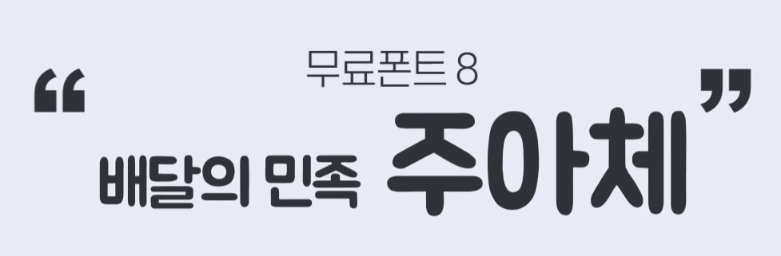

# 무료 폰트 추천

## 무료폰트 사이트

- 눈누 : https://noonnu.cc/

- 구글폰트 : https://fonts.google.com/


### 검은고딕



- 주소 : https://github.com/zesstype/Black-Han-Sans
- 특징
  - 영문 불가능
  - 두께 조절 불가능
  - 헤드라인용으로 유용
- 영문 가능 버전 존재 : https://fonts.google.com/specimen/Black+Han+Sans#standard-styles
- Embed

```html
<link href="https://fonts.googleapis.com/css2?family=Black+Han+Sans&display=swap" rel="stylesheet">

font-family: 'Black Han Sans', sans-serif;
```


### 에스코어 드림



- 주소 : http://www.s-core.co.kr/who-we-are/font/
- 특징
  - 두께 종류가 많다. (9개)
  - 글 내용이나 브로셔에 쓰기 유용

- Embed

```css
@font-face { font-family: 'SCDream'; src: url('https://cdn.jsdelivr.net/gh/projectnoonnu/noonfonts_six@1.2/S-CoreDream-1Thin.woff') format('woff'); font-weight: 100; }

@font-face { font-family: 'SCDream'; src: url('https://cdn.jsdelivr.net/gh/projectnoonnu/noonfonts_six@1.2/S-CoreDream-2ExtraLight.woff') format('woff'); font-weight: 200; }

@font-face { font-family: 'SCDream'; src: url('https://cdn.jsdelivr.net/gh/projectnoonnu/noonfonts_six@1.2/S-CoreDream-3Light.woff') format('woff'); font-weight: 300; }

@font-face { font-family: 'SCDream'; src: url('https://cdn.jsdelivr.net/gh/projectnoonnu/noonfonts_six@1.2/S-CoreDream-4Regular.woff') format('woff'); font-weight: 400; }

@font-face { font-family: 'SCDream'; src: url('https://cdn.jsdelivr.net/gh/projectnoonnu/noonfonts_six@1.2/S-CoreDream-5Medium.woff') format('woff'); font-weight: 500; }

@font-face { font-family: 'SCDream'; src: url('https://cdn.jsdelivr.net/gh/projectnoonnu/noonfonts_six@1.2/S-CoreDream-6Bold.woff') format('woff'); font-weight: 600; }

@font-face { font-family: 'SCDream'; src: url('https://cdn.jsdelivr.net/gh/projectnoonnu/noonfonts_six@1.2/S-CoreDream-7ExtraBold.woff') format('woff'); font-weight: 700; }

@font-face { font-family: 'SCDream'; src: url('https://cdn.jsdelivr.net/gh/projectnoonnu/noonfonts_six@1.2/S-CoreDream-8Heavy.woff') format('woff'); font-weight: 800; }

@font-face { font-family: 'SCDream'; src: url('https://cdn.jsdelivr.net/gh/projectnoonnu/noonfonts_six@1.2/S-CoreDream-9Black.woff') format('woff'); font-weight: 900; }
```


### 티몬소리체



- 주소 : https://brunch.co.kr/@creative/32
- 특징
  - 유튜브 썸네일에 많이쓰임
  - 너무 흔함


### Noto Sans



- 주소 : https://fonts.google.com/specimen/Noto+Sans+KR
- 특징
  - 고딕류 최강
  - 모든 폰트의 기본
  - 대부분 해외언어를 지원

- Embed

```html
<style>
@import url('https://fonts.googleapis.com/css2?family=Noto+Sans+KR:wght@100&display=swap');
</style>
```


### 잉크립퀴드



- 주소 : https://www.naturecollection.com/mall/brand.jsp?cate_seq=662#FontDownload
- 특징
  - 손글씨 폰트


### 즐거운 이야기체



- 주소 : http://tvn10festival.tving.com/playground/tvn10font

- 특징
  - 손글씨 폰트


### 스웨거체



- 주소 : http://www.swagger.kr/font.html

- 특징
  - 영문 가능
  - 강조, 제목에 유용
  - 두께 조절이 안됨




- 주소 : https://www.woowahan.com/#/fonts

- 특징
  - 동글동글함