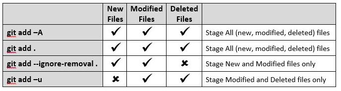
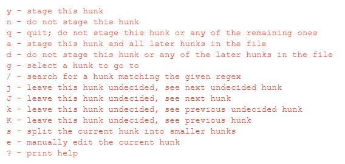

# 0. Init

## 공식문서

- 빈 Git repositoty를 생성
- .git 폴더 생성

## 쉽게

- init은 등록이다.

- Git으로 관리하고 싶은 폴더를 등록한다.


# 1. Add

## 공식문서

- 다음 commit을 위해 working tree의 내용을 index에 업데이트 하는 것
  - index에는 working tree 내용의 snapshot이 있으며
  - 이 snapshot은 다음 commit에 사용된다.
  - 즉, commit하기 전 반드시 add를 통해 index에 새로운 혹은 수정된 파일을 추가해야 한다. 
- 일반적으로 현재 경로 전체를 add하지만 옵션을 통해 부분적인 add도 가능하다.
- add는 commit 전에 여러번 사용할 수 있다. 

## 쉽게

- add는 기록이다.
- 현재 폴더에서 바뀐(생성/수정/삭제) 파일이 있다면 그 파일을 앞으로 관리를 할 것인가에 대해 선택을 할 수 있다.
- 관리를 원하는 파일들은 add 명령어를 통해 이뤄지며 index(stage)라는 곳에 기록이 된다.
- 다음단계인 commit 전에는 add를 여러번할 수 있고 관리하는 파일은 가장 최근 상태가 반영된다.

## Option

```bash
0. 모든파일
git add .	// 현재 디렉토리의 모든 파일 대상
git add -A	// 현재 디렉토리의 모든 파일 대상
git add *	// 현재 디렉토리의 모든 파일 대상(.으로 시작하는 파일 제외 ex>.gitignore)
git add -u	// 현재 디렉토리의 모든 파일 중 수정/삭제된 파일 대상

1. 파일단위
git add <file>
> git add test.py	// 파일이름 직접 지정
> git add *.py		// 확장자 지정

2. 폴더단위
git add <directory>
> git add ./01_python/	// 폴더이름 직접 지정

3. 파일+폴더
git add <directory><file>
> git add Documentation/\*.txt

4. 대화식모드
// 수정파일 대상으로, 수정된 부분을 git에서 hunk 단위로 나누어준다. 
// 각 hunk를 통해 변경사항을 보여주고 hunk를 기준으로 add 여부를 체크한다.
git add -p
```






# 2. Commit

## 공식문서

- index에 담겨있는 현재 내용들을 log message와 함께 commit 한다.
  - log message는 변경된 것을 설명함

- 새로운 commit은 일반적으로 현재 branch의 끝부분이며 branch는 이 commit을 가르키도록 업데이트 된다.

## 쉽게

- commit은 저장이다.
- 앞서 add를 통해 index에 관리하고 싶은 파일을 기록했을 것이다.
- 그럼 commit을 통해 index에 담긴 정보를 내 컴퓨터에 저장을 한다.

## Option

```bash
1. 메세지남기기
git commit -m "commit message"
> git commit -m "today 배운내용"

2. add 포함하기
git commit -a

3. 메세지 + add포함
git commit -am "commit message"
> git commit -am "add 안해도됨"

3. 마지막 commit 덧붙이기
git commit --amend

4. 대화식모드
// git add -p와 마찬가지로 커밋하는 변경사항을 보여준다.
// 
git commit -v
```


# 3. Push

## 공식문서

- local reference를 사용해서 remote reference를 업데이트

## 쉽게

- push는 전달이다.
- 저장된 commit을 이용해 내 컴퓨터에 저장된 정보를 원격저장소에 전달을 한다.
  - 마지막 commit의 내용을 바탕으로 파일이 업로드된다.
  - 그 외의 commit 중 원격저장소에 없는 것은 정보만 전달하여 기록을 확인할 수 있다.

