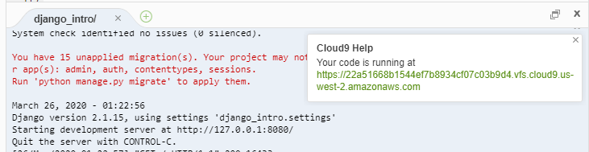

# django

> 파이썬 웹 프레임워크

## 설치

```bash
$ pip install django==2.1.15
```

- 수업에서는 `2.1.15`를 기준으로 진행 예정입니다.


## django 프로젝트 시작

### 프로젝트 생성

```bash
$ django-admin startprojent {프로젝트명}
```

### 서버실행

- 반드시 서버 실행시 명령어가 실행되는 디렉토리를 확인할 것.

```bash
~/ $ cd django_intro
~/django_intro/ $ python manage.py runserver 8080
```

- 실행된 서버는 우측의 영역의 url을 클릭한다.



- 서버 종료는 터미널에서 `ctrl + c` 함께 입력한다.

### 어플리케이션

- 어플리케이션 생성

```bash
~/ $ python manage.py startapp pages
```

- `settings.py`의 `INSTALLED_APPS`(33번 줄) 리스트에 Local Apps 추가

```python
INSTALLED_APPS = [
    'pages',
# pages라는 app을 추가해서 pages 추적이 가능해짐
```

- `pages` / `view.py` 접속

```python
# 이 함수가 실행되면 index.html을 보여주겠다.
def index(request):
    return render(request, 'index.html')
```

- `django_intro` / `urls.py` 접속

```python
from pages import views

urlpatterns = [
    path('index/', views.index)
    
# 사용자가 index/로 들어오면 views.py로 보내줌 즉, views.py의 함수가 실행됨
```

- `pages` / `templates`/`index.html` 생성 후 HTML 입력
- 실행순서
  1.  `manage.py runserver 8080`을 통해 열린 url에서 `/index`에 들어감 (`urls.py`의 path에 명시되어 있어야 함)
  2. `urls.py`에서 명시된 path안에 index를 찾고 거기에 다시 명시된 함수를 실행시킴 (위에서는 `views.index`)
  3. `views.index`는 views안에 있는 `index`함수이다. 이때 `index`함수는 실행이되면 `index.html`을 렌더링함
  4.  render할 temlate 파일들을 찾을 때, `settings.py`에 등록된(`INSTALLED_APPS`) 각 앱의 `templates`폴더 내부를 탐색 함 따라서, 실행할 HTML파일은 무조건 생성된 어플리케이션 폴더 안의 `templates`폴더에 위치해야 함.
  5.  만약 각각 다른앱에서 같은이름의 `HTML` 파일이 있다면 `INSTALLED_APPS`에서 먼저 등록된 순서에서만 실행되고 이후 앱에서는 실행되지 않음
  6.  `temlates`폴더 안의 `index.html`에 작성된 코드가 `/index` url에서 보여짐


### 리눅스 명령어

- `cd` : change directory

  ```bash
  # django_intro 폴더로 이동
  ~/ $ cd django_intro/
  ~/django_intro $
  # 상위 디렉토리로 이동
  ~/django_intro $ ch ..
  ~/ $
  ```

- `ls` : 현재 디렉토리 파일 목록

  ```bash
  ~/django_intro $ ls
  db.sqlite3 django_intro/ manage.py*
  ```

- `touch` : 파일을 만듦

- `rm` + 파일명 : 파일 삭제

`showmigrations` : migrations 만든 걸 확인

